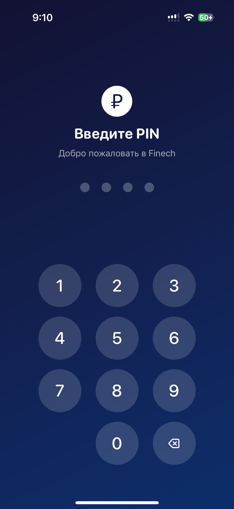
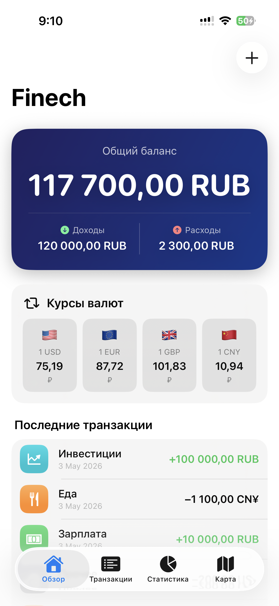
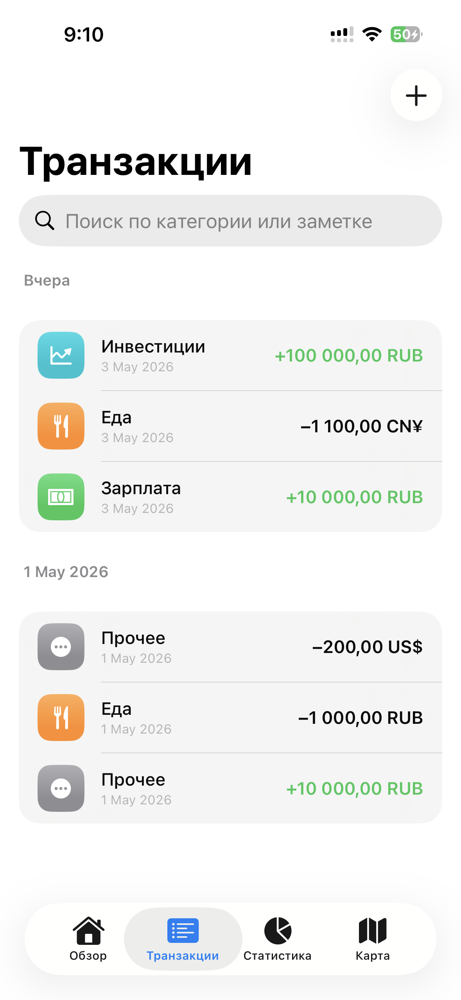
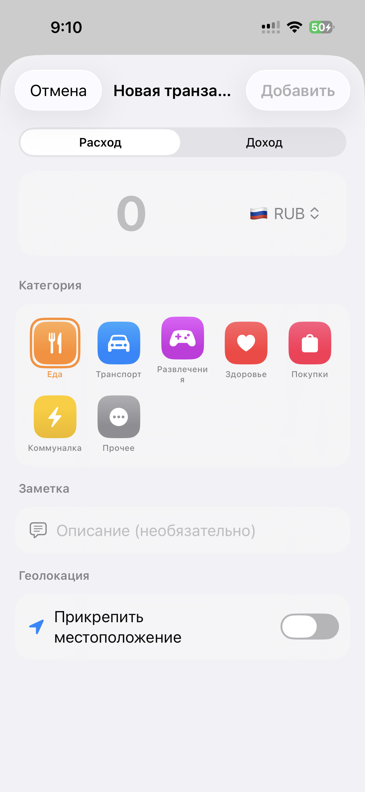
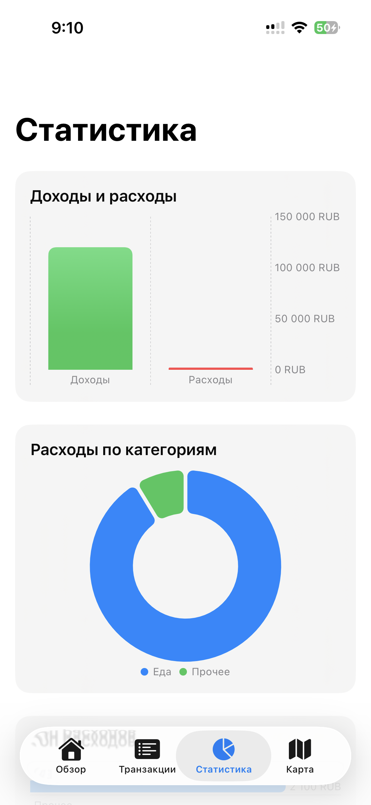
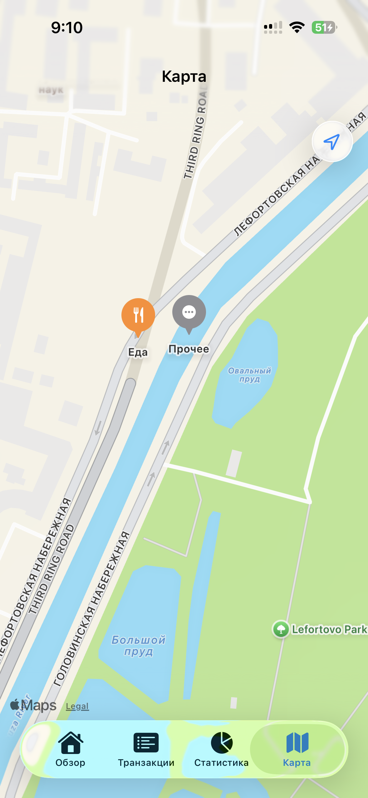

# Finech — Личные финансы

Мобильное iOS-приложение для управления личными финансами. Позволяет отслеживать доходы и расходы, просматривать актуальные курсы валют, анализировать статистику трат и видеть транзакции на карте.

---

## Скриншоты

<p float="left">
  
  
  
  
  
  
</p>

---

## Возможности

- **Учёт финансов** — добавление доходов и расходов с выбором категории, заметкой и датой
- **Мультивалютность** — транзакции в 10 валютах (RUB, USD, EUR, GBP, CNY и др.) с автоматическим пересчётом баланса в рублях по актуальному курсу
- **Курсы валют** — виджет на главном экране показывает курс USD, EUR, GBP и CNY к рублю; данные обновляются через внешний API с кешированием на 1 час
- **Статистика** — графики доходов и расходов, круговая диаграмма и топ трат по категориям
- **Карта** — транзакции с геолокацией отображаются на карте цветными пинами по категориям
- **Безопасность** — вход в приложение защищён PIN-кодом и Face ID / Touch ID
- **Защита от овердрафта** — при добавлении расхода в рублях проверяется доступный баланс

---

## Технологии

| Слой | Технология |
|------|------------|
| UI | SwiftUI |
| Архитектура | MVVM |
| Локальное хранение | CoreData |
| Реактивные события | Combine |
| Асинхронные операции | async/await |
| Безопасность | Keychain, Face ID / Touch ID (LocalAuthentication) |
| Карта | MapKit |
| Геолокация | CoreLocation |
| Графики | Swift Charts |
| Курсы валют | [exchangerate-api.com](https://www.exchangerate-api.com) REST API |

---

## Архитектура

```
Finech/
├── Models/
│   ├── Transaction.swift             # Модель транзакции, категории, типы
│   └── ExchangeRate.swift            # Модель курса валюты
├── ViewModels/
│   ├── TransactionViewModel.swift    # CRUD транзакций, подсчёт баланса
│   └── ExchangeRateViewModel.swift   # Загрузка и сортировка курсов (Combine)
├── Views/
│   ├── Dashboard/                    # Главный экран с балансом и виджетом курсов
│   ├── Transactions/                 # Список, добавление и редактирование транзакций
│   ├── Statistics/                   # Графики и диаграммы
│   ├── Map/                          # Карта транзакций
│   └── PIN/                          # Экран PIN и настройка биометрии
├── Services/
│   ├── ExchangeRateService.swift     # Сетевой слой + кеш (Combine + async/await)
│   ├── KeychainService.swift         # Хранение PIN и настроек биометрии
│   └── LocationManager.swift         # Работа с геолокацией
└── CoreData/
    ├── TransactionEntity.swift       # NSManagedObject транзакции
    └── PersistenceController.swift   # Настройка CoreData стека
```

---

## Запуск

**Требования:** iOS 17+, Xcode 16+

```bash
git clone https://github.com/Dag0sh/Finech.git
cd Finech
open Finech.xcodeproj
```

Выбери симулятор или подключённое устройство → **Cmd + R**

> При первом запуске потребуется создать PIN-код. Биометрия настраивается по желанию.

---

## Автор

**Dagosh** — [github.com/Dag0sh](https://github.com/Dag0sh)
